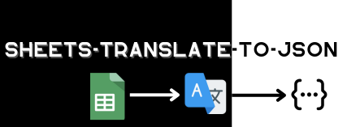

<div class="text--center">
    
</div>

**sheets-translate-to-json** is a library designed to simplify interactions with Google Sheets in Node.js applications. It provides a smooth and powerful interface for reading and writing data in spreadsheets, making data management more intuitive and less tedious.

## Why **sheets-translate-to-json**?

The **sheets-translate-to-json** project was created to fill the need for seamless integration between Node.js applications and Google Sheets. It aims to offer a simple yet effective solution for manipulating spreadsheets without worrying about the underlying technical details.

## Get Started Now


# Installation

Welcome to the installation section of `sheet-translate-to-json`, a powerful library for managing and interacting with Google Sheets in Node.js. Follow these steps to properly install and configure the library in your project.

---------

## Prerequisites

Before you begin, make sure you have the following installed and configured:

- Node.js (version 14.x or higher)
- npm (usually included with Node.js)

## Installing the Library

Open your terminal and run the following command in your project directory to install `sheets-translate-to-json`:

```bash
npm install sheets-translate-to-json
```
or 

```bash
yarn add sheets-translate-to-json
```

or

```bash
pnpm install sheets-translate-to-json
```
---

## Initialization

To start using `sheets-translate-to-json`, you first need to create an instance of the `SheetManager` class.

### Constructor

```javascript
const manager = new SheetManager(privateKey, clientEmail, sheetId);
```

| Parameter   | Type   | Description                                   |
|-------------|--------|-----------------------------------------------|
| privateKey  | String | The private key of your service account.      |
| clientEmail | String | The email associated with your service account.|
| sheetId     | String | The ID of your Google Sheets sheet.           |

## Methods

### init

Initializes the connection to the spreadsheet and writes data to a specified path.

```javascript
manager.init(userPath);
```

| Parameter | Type   | Description                                  |
|-----------|--------|----------------------------------------------|
| userPath  | String | The path of the folder where to write data.  |

### read (async)

Reads data from the specified spreadsheet.

```javascript
manager.read(sheetPosition).then(data => {
  // Use the data here
});
```

| Parameter    | Type   | Description                                       |
|--------------|--------|---------------------------------------------------|
| sheetPosition| Number | The position of the sheet in the workbook (0-index).|

### write (async)

Writes data to a JSON file in the specified path.

```javascript
manager.write(data, directoryPath);
```

| Parameter    | Type   | Description                                      |
|--------------|--------|--------------------------------------------------|
| data         | Object | The data to write.                               |
| directoryPath| String | The path of the folder where to write JSON files.|

## Examples of Using SheetManager

### Using the `init` Method

The `init` method of `SheetManager` automates the process of reading data from the Google Sheets spreadsheet and writing this data into JSON files.

```javascript
const manager = new SheetManager(privateKey, clientEmail, sheetId);

// Path where JSON files will be saved
const userPath = './translations';

// Initialization and automatic processing
manager.init(userPath)
  .then(() => console.log('Data successfully read and written.'))
  .catch(err => console.error('Error during initialization:', err));
```

In this example, `init` takes care of the entire process: it establishes the connection, reads the data from the specified spreadsheet, and writes this data to the `./translations` directory.

### Separately Using the `read` and `write` Methods

If you prefer more control over the process, you can use the `read` and `write` methods separately. This allows you to manipulate the data between reading and writing if necessary.

```javascript
const manager = new SheetManager(privateKey, clientEmail, sheetId);

// Reading data from the first spreadsheet
manager.read()
  .then(data => {
    console.log('Data successfully read.');
    // Data processing or manipulation here if needed

    // Path where JSON files will be saved
    const directoryPath = './translations';
    // Writing data into JSON files
    manager.write(data, directoryPath);
    console.log('Data written into JSON files.');
  })
  .catch(err => console.error('Error during reading:', err));
```

In this scenario, `read` is used to retrieve the data from the spreadsheet, and after any potential data processing, `write` is used to write this data into local JSON files.

---

### Result of Executing the SheetManager Script

After running the `SheetManager` script, the following folder is created with the generated JSON files:


---


### The Author

**sheets-translate-to-json** is a creation of [@josephjoberno](https://github.com/josephjoberno), a developer passionate about automating and optimizing work processes. His goal is to make data operations more accessible and less complex for developers at all levels.

### Contributions

We are always excited to welcome new contributions! If you want to contribute to **sheets-translate-to-json**, here's how you can do it:

1. **Fork the project**: Start by forking the project on GitHub.
2. **Clone your fork**: Clone your fork to your local machine.
3. **Create a new branch**: It's best to work on a new branch for any new feature or fix.
4. **Make your changes**: Add or modify features as per your ideas.
5. **Test your changes**: Ensure your code works as expected.
6. **Submit a Pull Request**: Create a Pull Request to merge your changes into the main project.

For more details on contributing, please check our contribution guide on GitHub.