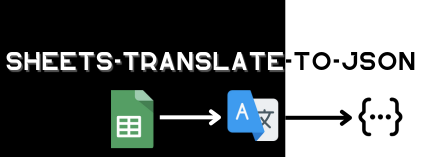

# sheets-translate-to-json

[](https://www.npmjs.com/package/sheets-translate-to-json)
[](https://github.com/josephjoberno/sheets-translate-to-json/blob/main/LICENSE)
[](https://www.npmjs.com/package/sheets-translate-to-json)

Convert Google Sheets translations into structured JSON files for your i18n workflow.

<div align="center">
  
</div>

## Installation

```bash
npm install sheets-translate-to-json
```

## Quick start

```typescript
import { SheetManager } from 'sheets-translate-to-json';

const manager = new SheetManager(
  process.env.PRIVATE_KEY,
  process.env.CLIENT_EMAIL,
  process.env.SHEET_ID
);

// Read all sheets and write JSON files
await manager.init('./translations');
```

This reads your Google Sheet and generates one JSON file per language (`en.json`, `fr.json`, etc.) in the specified directory.

## Features

- **One-command workflow** — `init()` reads and writes in a single call
- **Multi-sheet support** — Process specific sheets or merge all sheets automatically
- **Nested keys** — Dot-notation keys (e.g., `nav.home`) are expanded into nested JSON
- **TypeScript** — Full type definitions included
- **Dual module** — Works with both ESM and CommonJS
- **Two-way sync** — Push local changes back to Google Sheets, or use `sync` to reconcile both directions

## API

### `new SheetManager(privateKey, clientEmail, sheetId)`

Creates a new instance connected to your Google Sheet.

### `manager.init(directory, sheetNames?)`

Reads data from the spreadsheet and writes JSON files to the specified directory. Optionally pass an array of sheet names to process only specific sheets.

```typescript
// Process all sheets
await manager.init('./translations');

// Process specific sheets only
await manager.init('./translations', ['Homepage', 'Settings']);
```

### `manager.read(sheetPosition?)`

Reads data from a single sheet by index (default: `0`).

```typescript
const data = await manager.read();     // first sheet
const data = await manager.read(2);    // third sheet
```

### `manager.readByName(sheetName)`

Reads data from a sheet by its name.

```typescript
const data = await manager.readByName('Homepage');
```

### `manager.readAllSheets()`

Reads data from all sheets. Returns an object keyed by sheet name.

```typescript
const allData = await manager.readAllSheets();
```

### `manager.write(data, directory)`

Writes a `SheetData` object to JSON files (one per language).

```typescript
const data = await manager.read();
manager.write(data, './translations');
```

### `manager.readLocal(directoryPath)`

Reads JSON files from a local directory back into `SheetData` format. Throws if the directory doesn't exist. Only reads `.json` files.

```typescript
const data = manager.readLocal('./translations');
```

### `manager.push(directoryPath, sheetName?)`

Reads local JSON files and uploads them to Google Sheets. Nested objects are flattened back to dot-notation. If `sheetName` is provided and doesn't exist, a new sheet is created.

```typescript
await manager.push('./translations');
await manager.push('./translations', 'Homepage');
```

### `manager.sync(directoryPath, options?)`

Two-way sync between local JSON files and Google Sheets. Returns a `SyncResult` describing what changed.

```typescript
const result = await manager.sync('./translations');
// Strategies: 'local' | 'remote' | 'merge' (default)
await manager.sync('./translations', { strategy: 'local', sheetName: 'Homepage', createSheet: true });
```

### `manager.listSheets()`

Returns the names of all sheets in the spreadsheet.

```typescript
const names = await manager.listSheets();
// ['Homepage', 'Settings', 'Emails']
```

## Spreadsheet format

| key | en | fr | es |
|-----|----|----|-----|
| greeting | Hello | Bonjour | Hola |
| nav.home | Home | Accueil | Inicio |
| nav.about | About | A propos | Acerca de |

Dot-notation keys are automatically expanded:

```json
{
  "greeting": "Hello",
  "nav": {
    "home": "Home",
    "about": "About"
  }
}
```

## Prerequisites

- Node.js >= 18.0
- A Google Cloud service account with Google Sheets API enabled

See the [full documentation](https://josephjoberno.github.io/sheets-translate-to-json/) for setup instructions.

## License

[ISC](./LICENSE)
